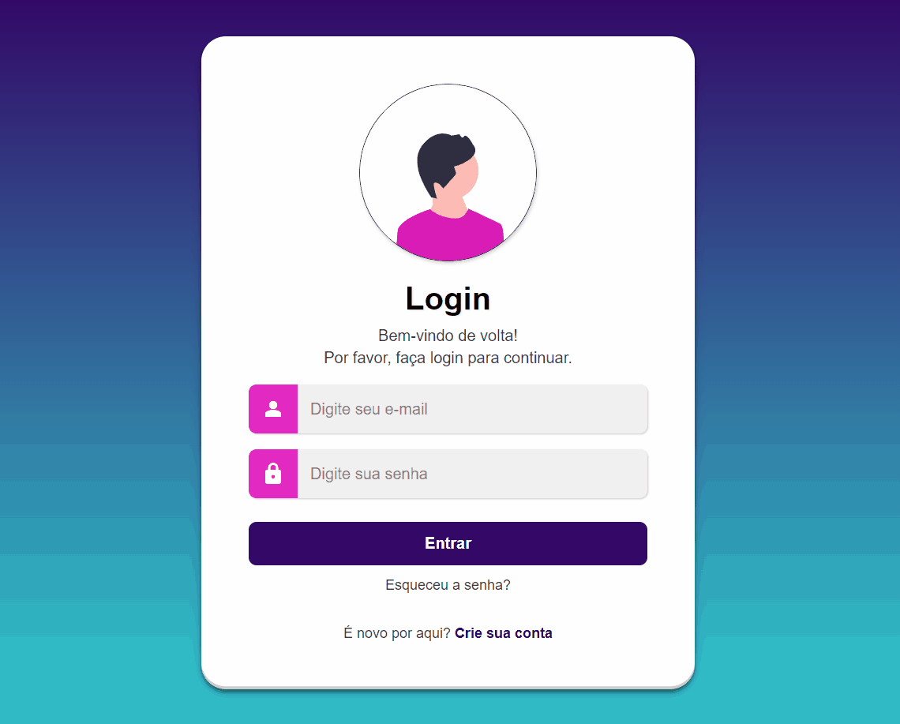

# Tela de Login Moderna
[🇺🇸 English](./README.en.md) | [🇧🇷 Português](./README.md)


Uma tela de login moderna e responsiva com design elegante, construída com HTML5 e CSS3 puro. Apresenta gradientes suaves, animações fluidas e interface intuitiva para uma experiência de usuário agradável.	

---

### 📋 Índice
- [Visão Geral do Projeto](#-visão-geral-do-projeto)
- [Estrutura de Diretórios](#-estrutura-de-diretórios)
- [Destaques & Funcionalidades](#-destaques--funcionalidades)
- [Tecnologias Utilizadas](#-tecnologias-utilizadas)
- [Pré-requisitos](#-pré-requisitos)
- [Instalação](#-instalação)
- [Como Usar](#-como-usar)
- [Configuração](#-configuração)
- [Responsividade](#-responsividade)
- [Validação e Tratamento de Erros](#-validação-e-tratamento-de-erros)
- [Contribuição](#-contribuição)
- [Melhorias Futuras](#-melhorias-futuras)
- [Licença](#-licença)
- [Autora](#-autora)

---

## 🚀 Visão Geral do Projeto

[](https://emellybmuniz.github.io/tela-login-responsiva/)

Uma interface de login moderna que combina design minimalista com funcionalidade robusta. O projeto demonstra técnicas avançadas de CSS3, incluindo gradientes complexos, box-shadows elaboradas e design responsivo adaptativo, criando uma experiência visual envolvente e profissional.

**Contexto e Motivação:** Desenvolvido para demonstrar competências em design de interfaces modernas, focando na criação de componentes reutilizáveis e experiências de usuário otimizadas.

**Principais Benefícios:**
- Interface limpa e intuitiva que reduz fricção no processo de login
- Design responsivo que funciona perfeitamente em todos os dispositivos
- Implementação de boas práticas de acessibilidade e UX
- Código limpo e bem estruturado, fácil de manter e expandir

**Público-alvo:** Desenvolvedores front-end, designers de UI/UX e estudantes interessados em interfaces modernas e responsivas.

**Conceitos Técnicos Demonstrados:** CSS Grid/Flexbox, CSS Custom Properties (variáveis), responsive design, Material Design Icons, técnicas avançadas de styling e otimização de performance.

## 📂 Estrutura de Diretórios

```bash
📦 tela-login-responsiva/
├── favicon/
│   └── favicon.ico            # Ícone do site
├── imagens/
│   ├── undraw_male_avatar_g98d.svg    # Avatar masculino principal
│   └── undraw_profile_pic_re_iwgo.svg # Avatar alternativo (perfil)
├── styles/
│   └── style.css              # Folha de estilos principal com CSS customizado
├── .gitattributes             # Configurações do Git para normalização de texto
├── index.html                 # Página principal da aplicação
├── README.en.md               # Documentação em inglês 
├── README.md                  # Este arquivo de documentação
└── LICENSE                    # Licença do projeto
```

## ✨ Destaques & Funcionalidades

### 🎨 **Design Visual Moderno**
- Gradiente linear dinâmico de `#30cfd0` para `#330867` criando profundidade visual
- Paleta de cores harmoniosa com accent color `#e32ac1` para elementos interativos
- Box-shadows multicamadas para efeito de profundidade e elevação
- Tipografia otimizada com hierarquia visual clara

### 📱 **Interface Responsiva Inteligente**
- Layout adaptativo que se reorganiza em orientação landscape em telas pequenas
- Breakpoints estratégicos para dispositivos móveis (480px) e telas baixas
- Imagens vetoriais SVG que mantêm qualidade em qualquer resolução
- Design mobile-first com progressive enhancement

### 🎯 **Experiência do Usuário Otimizada**
- Campos de entrada com ícones Material Design integrados
- Animações suaves de hover e focus com transições CSS
- Estados visuais claros para interações do usuário
- Feedback visual imediato em todas as interações

### ✅ **Formulário Estruturado e Acessível**
- Validação HTML5 nativa para email e campos obrigatórios
- Labels semânticos com ícones descritivos
- Autocomplete configurado para email e senha
- Estrutura de formulário otimizada para screen readers

### 🔧 **Código Limpo e Manutenível**
- CSS Custom Properties (variáveis CSS) para fácil customização
- Arquitetura BEM-like para nomenclatura de classes
- Código semântico com elementos HTML5 apropriados
- Otimização de performance com carregamento eficiente de recursos

## 🛠️ Tecnologias Utilizadas

Este projeto foi construído utilizando as seguintes tecnologias:


### Detalhes Técnicos:
- **HTML5**: Estrutura semântica com elementos modernos, formulários acessíveis e meta tags otimizadas
- **CSS3**: Flexbox, CSS Grid, Custom Properties, gradientes avançados, animações e media queries
- **Material Design Icons**: Sistema de ícones do Google para interface consistente
- **SVG Graphics**: Ilustrações vetoriais responsivas e otimizadas para web

## ⚙️ Pré-requisitos

**Ambiente de Desenvolvimento:**
- Navegador web moderno (Chrome 70+, Firefox 65+, Safari 12+, Edge 79+)
- Editor de código (recomendado: VS Code, Sublime Text, ou similar)
- Servidor local opcional (Live Server, Python HTTP Server, ou similar)

## 📦 Instalação

```bash
# 1. Clone este repositório
$ git clone https://github.com/emellybmuniz/tela-login-responsiva.git

# 2. Navegue até o diretório do projeto
$ cd tela-login-responsiva

# 3. Abra o arquivo index.html no seu navegador
# Ou use um servidor local para melhor experiência:
$ python -m http.server 3000
# Ou se tiver o Live Server no VS Code, clique com botão direito -> "Open with Live Server"
```

**Alternativa:** [Acesse a versão online](https://emellybmuniz.github.io/tela-login-responsiva/)

## 💡 Como Usar

1. **Acesso à Aplicação** - Abra o arquivo `index.html` em um navegador web moderno ou acesse a versão online
2. **Preenchimento do Email** - Digite um endereço de email válido no campo com ícone de pessoa
3. **Inserção da Senha** - Digite sua senha no campo com ícone de cadeado
4. **Login** - Clique no botão "Entrar" para processar o formulário (atualmente sem backend)
5. **Funcionalidades Adicionais** - Explore os links para "Esqueceu a senha?" e "Crie sua conta"

### Exemplos de Uso:
```html
<!-- Estrutura básica do formulário -->
<form action="#" class="login-form" autocomplete="on">
  <div class="form-field">
    <label for="email">
      <span class="material-symbols-outlined">person</span>
    </label>
    <input type="email" name="email" id="email" 
           placeholder="Digite seu e-mail" 
           autocomplete="email" required />
  </div>
</form>
```

## ⚙️ Configuração

### Configurações de Cores (CSS Custom Properties):
- **--grad-start**: `#30cfd0` (Cor inicial do gradiente)
- **--grad-end**: `#330867` (Cor final do gradiente)
- **--primary-accent**: `#e32ac1` (Cor de destaque principal)
- **--card-bg**: `#ffffff` (Cor de fundo do card)
- **--text-primary**: `#3d3d3d` (Cor do texto principal)

### Configurações de Layout:
```css
:root {
  --grad-start: #30cfd0;
  --grad-end: #330867;
  --primary-accent: #e32ac1;
  --card-bg: #ffffff;
  --font-family: Arial, Helvetica, sans-serif;
}
```

## 📱 Responsividade

### Desktop (> 480px)
- Card centralizado com largura máxima de 500px
- Layout vertical com espaçamentos generosos
- Avatar de 180x180px com efeitos de sombra
- Formulário com campos expandidos

### Mobile (≤ 480px)
- Padding reduzido do card para aproveitamento máximo da tela
- Avatar redimensionado para 120x120px
- Título reduzido para 1.8rem
- Espaçamentos otimizados para toque

### Landscape em Telas Pequenas (altura ≤ 500px)
- Layout reorganizado horizontalmente
- Avatar ocultado para economizar espaço
- Card expandido até 700px de largura
- Conteúdo distribuído em colunas

## 🛡️ Validação e Tratamento de Erros

### Validações Implementadas:
- **Campo Email**: Validação HTML5 nativa com `type="email"` e `required`
- **Campo Senha**: Validação de campo obrigatório com `required`
- **Autocomplete**: Configurado para `email` e `current-password` seguindo padrões web

### Tratamento Visual:
- Estados de foco claros com outline customizado
- Placeholders descritivos para orientar o usuário
- Ícones visuais que reforçam o propósito de cada campo

## 🤝 Contribuição

Contribuições são sempre bem-vindas e **muito apreciadas!** Sinta-se à vontade para abrir uma _issue_ ou enviar um _pull request_.

### Como contribuir:
1. **Fork** este repositório
2. **Clone** seu fork: `git clone https://github.com/seu-usuario/tela-login-responsiva.git`
3. **Crie uma branch** para sua feature: `git checkout -b feature/nova-funcionalidade`
4. **Faça suas alterações** e teste completamente
5. **Commit** suas mudanças: `git commit -m 'Adiciona nova funcionalidade'`
6. **Push** para a branch: `git push origin feature/nova-funcionalidade`
7. **Abra um Pull Request** com descrição detalhada das mudanças

### Diretrizes para Contribuição:
- Mantenha o código limpo e bem comentado
- Respeite a estrutura de nomenclatura existente
- Teste a responsividade em diferentes dispositivos

## 🚀 Melhorias Futuras

### Próximas Funcionalidades:
- [ ] **Integração com Backend** - Implementar autenticação real com API
- [ ] **Validação Avançada** - Verificação de força de senha e feedback visual
- [ ] **Modo Escuro** - Toggle entre temas claro e escuro
- [ ] **Animações Micro-interações** - Loading states e transições avançadas
- [ ] **Recuperação de Senha** - Modal funcional para reset de senha
- [ ] **Cadastro de Usuário** - Página de registro integrada
- [ ] **Login Social** - Autenticação via Google, Facebook, GitHub
- [ ] **Lembar Credenciais** - Opção "Lembrar de mim" funcional


## 🔑 Licença

Este projeto está licenciado sob a **Licença MIT** - consulte o arquivo [LICENSE](LICENSE) para obter mais detalhes.

A Licença MIT permite uso comercial, modificação, distribuição e uso privado, exigindo apenas a manutenção do aviso de copyright.

## ✍️ Autora

Desenvolvido por **Emelly Beatriz** com ❤️

📬 Entre em contato:

📧 emellybmuniz@gmail.com |
💼 [Linkedin](https://www.linkedin.com/in/emellybmuniz) |
🐙 [Github](https://github.com/emellybmuniz)

---

⭐ **Gostou do projeto?** Deixe uma estrela no repositório para apoiar o desenvolvimento!

